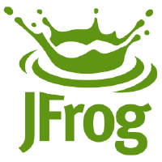

---

The ***JFrog*** Platform gives you an end-to-end pipeline to control the flow of your binaries from build to production. It has been designed to provide developers and administrators with a seamless DevOps experience across all ***JFrog*** products, including: ***JFrog*** Artifactory, ***JFrog*** Xray, ***JFrog*** Mission Control, ***JFrog*** Distribution, and ***JFrog*** Pipelines. 

The ***JFrog*** Platform is supported as a Cloud and a Self-Hosted solution. Learn more about the JFrog Platform, and then get started with your selected solution.
